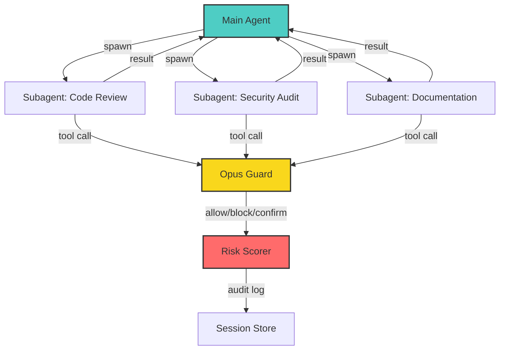

# Subagent Workflow System

**Ship better code with AI-powered review, parallel task execution, and built-in safety guards.**

The subagent workflow system enables you to spawn isolated AI agents for specific tasks — code review, parallel research, security audits — while maintaining control, visibility, and safety through intelligent gating and risk scoring.

---

## Why Subagents?

Traditional single-agent workflows force you to choose between:
- **Serial execution** (slow, blocks on each step)
- **Manual orchestration** (complex, error-prone)
- **Unrestricted AI** (risky, no guardrails)

Subagents solve this by providing:

✅ **Parallel execution** — spawn multiple agents for independent tasks  
✅ **Isolation** — each subagent has its own session and scope  
✅ **Safety** — Opus Guard intercepts high-risk operations  
✅ **Traceability** — full audit logs and session history  
✅ **Integration** — works with your existing GitHub/CI workflows

---

## Quickstart

### 1. Review code before creating a PR
```bash
# In your feature branch
openclaw grill

# Or target specific files
openclaw grill src/api/*.ts
```

Get instant feedback on bugs, security issues, and code style — before CI runs.

### 2. Parallel research tasks
```bash
# Spawn subagents for independent research
openclaw subagent spawn --label "api-research" "Research FastAPI alternatives"
openclaw subagent spawn --label "db-research" "Compare PostgreSQL vs MongoDB for time-series"

# Monitor progress
openclaw subagent list --label research
```

### 3. Run security audit with strict mode
```bash
# Enable stricter risk thresholds
openclaw grill --strict --focus=security
```

---

## Architecture



**Key components:**

- **Main Agent** — orchestrates subagent lifecycle, synthesizes results
- **Subagents** — isolated workers with scoped sessions and labels
- **Opus Guard** — intercepts high-risk tool calls (file deletion, network requests, etc.)
- **Risk Scorer** — evaluates threat level based on operation type, scope, and context
- **Session Store** — maintains audit logs and session history (`~/.clawdbot/agents/<agentId>/sessions/*.jsonl`)

---

## Core Workflows

| Workflow | Use Case | Doc |
|----------|----------|-----|
| **Code Review** | Pre-PR feedback, lint/security checks | [grill.md](./grill.md) |
| **Parallel Tasks** | Research, data gathering, multi-step ops | [use-subagents.md](./use-subagents.md) |
| **Safety Gating** | Risk scoring, audit logs, compliance | [opus-guard.md](./opus-guard.md) |

---

## Feature Matrix

| Feature | Benefit |
|---------|---------|
| **Session isolation** | Each subagent has its own context — no shared state leakage |
| **Label-based monitoring** | Group and track related subagents (`--label`) |
| **Risk-based gating** | Automatically block/confirm high-risk operations |
| **Audit trails** | Full JSONL logs for compliance and debugging |
| **GitHub integration** | Generate PR comments from grill results |
| **Conflict resolution** | Automatically detect and resolve overlapping changes |

---

## Next Steps

- **[Code Review with `/grill`](./grill.md)** — Learn how to review code before creating PRs
- **[Using Subagents](./use-subagents.md)** — When to parallelize vs sequential execution
- **[Opus Guard](./opus-guard.md)** — Understand the safety layer
- **[FAQ](./faq.md)** — Common questions about performance, cost, and debugging
- **[Comparison](./comparison.md)** — How subagent workflows compare to alternatives

---

## Configuration

Default settings work for most use cases. To customize:

```json5
{
  "agents": {
    "subagents": {
      "maxConcurrent": 5,
      "defaultTimeout": 300000,
      "riskThreshold": "medium"
    }
  },
  "grillDefaults": {
    "severity": "CONSIDER",
    "focusAreas": ["security", "performance", "maintainability"]
  }
}
```

See [FAQ](./faq.md#customizing-risk-thresholds) for advanced configuration.

---

## Learn More

- [GitHub Issues](https://github.com/openclaw/openclaw/issues) — Report bugs or request features
- [Docs](https://docs.openclaw.ai) — Full OpenClaw documentation
- [Community](https://t.me/openclawai) — Join the Telegram community
