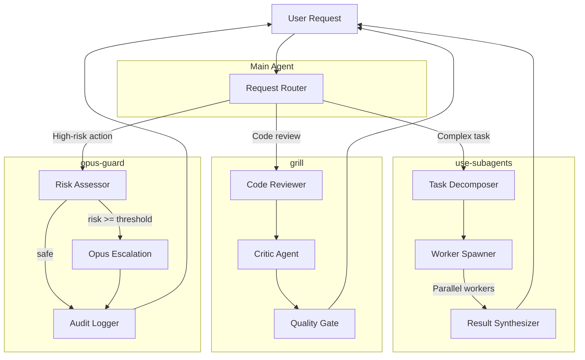

# Subagent Workflow System

> High-agency orchestration of specialized AI workers with quality gates and safety rails

The Subagent Workflow System is a three-part framework for managing complex AI-assisted work through coordinated subagents with built-in quality control and risk management.

## Architecture



## Components

### 1. use-subagents
**Purpose:** Decompose complex tasks into parallel workstreams

**When to use:**
- Multi-faceted feature implementation
- Research requiring diverse perspectives
- Refactoring with parallel analysis
- Architecture decisions needing exploration

**Flow:**
1. Analyze task complexity
2. Decompose into N independent subtasks (typically 2-6)
3. Spawn worker agents in parallel
4. Collect findings
5. Synthesize unified recommendation

### 2. grill
**Purpose:** Rigorous code review with dedicated critic perspective

**When to use:**
- Pull request review
- Pre-merge quality gate
- Security-sensitive changes
- Production deployment readiness

**Flow:**
1. Analyze code changes
2. Spawn critic agent (adversarial stance)
3. Critic evaluates against quality rubric
4. Categorize findings (MUST_FIX, SHOULD_FIX, NICE_TO_HAVE)
5. Gate decision (approve/block/warn)

### 3. opus-guard
**Purpose:** Safety rail for high-risk operations

**When to use:**
- External API calls with side effects
- Production deployments
- Data deletion/migration
- Financial transactions
- Publishing/broadcasting

**Flow:**
1. Intercept potentially risky action
2. Assess risk score (0.0-1.0)
3. If risk >= threshold: escalate to Opus model
4. Opus evaluates with higher reasoning capacity
5. Log decision with audit trail
6. Proceed or block

## Integration Patterns

### Pattern 1: Research → Implement → Review → Deploy

```
User: "Build OAuth integration, use subagents"

1. use-subagents
   → Workers analyze: security, DX, scalability, maintenance
   → Synthesis: "Recommend Passport.js with JWT refresh tokens"

2. [Developer implements]

3. User: "/grill"
   → Critic finds: missing rate limiting, no token rotation
   → Gate: MUST_FIX × 2 → ❌ BLOCKED

4. [Developer fixes issues]

5. User: "/grill"
   → Critic: all clear
   → Gate: ✅ APPROVED

6. User: "Deploy to production"
   → opus-guard: risk=0.92 (high)
   → Opus review: "Proceed with pre-flight checklist"
   → Audit log: deployment approved with conditions
   → ✅ PROCEED
```

### Pattern 2: Solo Work with Safety Net

```
User: "Refactor auth module"

[Agent works normally]

Agent: "Ready to commit"
→ opus-guard: risk=0.15 (low - workspace only)
→ Auto-approve, audit log
→ ✅ PROCEED
```

### Pattern 3: Emergency Override

```
User: "URGENT: revert bad deploy NOW"

Agent: "This is high-risk production change"
→ opus-guard: risk=0.98
→ Opus: "Critical incident - proceed with justification"
→ Audit: EMERGENCY_OVERRIDE logged
→ ⚠️ PROCEED (with warning)
```

## Configuration

### Global Config

```bash
# Enable subagent system
clawdbot config set subagent_workflow.enabled=true

# Set risk threshold for Opus escalation
clawdbot config set opus_guard.risk_threshold=0.7

# Max parallel workers
clawdbot config set use_subagents.max_workers=6

# Grill strictness (strict|balanced|permissive)
clawdbot config set grill.mode=balanced
```

### Per-Skill Config

```yaml
# ~/.clawdbot/config/subagent-workflow.yml
use_subagents:
  max_workers: 6
  timeout_minutes: 10
  synthesis_model: claude-opus-4

grill:
  mode: balanced
  auto_block_security: true
  critic_model: claude-sonnet-4

opus_guard:
  risk_threshold: 0.7
  audit_path: ~/.clawdbot/audit/
  auto_approve_below: 0.3
  always_block_above: 0.95
```

## Installation

### Quick Install (All Three Skills)

```bash
./examples/install-all.sh
```

### Manual Install

```bash
# Install each skill
clawdbot skill install skills/grill
clawdbot skill install skills/use-subagents
clawdbot skill install skills/opus-guard

# Enable system
clawdbot config set subagent_workflow.enabled=true
```

## Usage Examples

### Use Subagents

```bash
# Explicit invocation
/use-subagents Analyze our API design for REST vs GraphQL vs gRPC

# Auto-trigger (if configured)
"Research the best caching strategy for our use case, consider all options"
```

### Grill

```bash
# Manual review
/grill

# With specific target
/grill src/auth/

# Pre-commit hook (advanced)
git commit → triggers /grill automatically
```

### Opus Guard

```bash
# Mostly automatic - watches for risky operations
# No manual invocation needed

# Check audit log
clawdbot audit show --last 10

# Override in emergency
/override "Reverting bad production deploy"
```

## Monitoring

### Status Check

```bash
clawdbot subagents status
```

Output:
```
Subagent Workflow Status

use-subagents:  ✅ enabled  (0 active workers)
grill:          ✅ enabled  (last run: 2m ago, ✅ APPROVED)
opus-guard:     ✅ enabled  (24h: 12 approvals, 2 escalations, 0 blocks)

Config:
  Risk threshold:     0.70
  Max workers:        6
  Audit log:          ~/.clawdbot/audit/
```

### Audit Trail

```bash
# Recent decisions
clawdbot audit show --last 20

# Filter by type
clawdbot audit show --type opus_guard --since "1 day ago"

# Export for compliance
clawdbot audit export --format json --output audit-2026-01.json
```

## Troubleshooting

### Issue: Subagents not spawning

**Symptoms:** Tasks that should spawn workers run as single-agent

**Solutions:**
1. Check `subagent_workflow.enabled=true`
2. Verify model has context window for parallel workers
3. Check `use_subagents.max_workers` not set to 0
4. Review logs: `clawdbot logs --filter use-subagents`

### Issue: Opus Guard blocking everything

**Symptoms:** All actions escalate to Opus, high latency

**Solutions:**
1. Raise `opus_guard.risk_threshold` (try 0.8)
2. Lower `auto_approve_below` (try 0.4)
3. Check risk scoring function (may be misconfigured)
4. Review audit log for pattern: `clawdbot audit show --type opus_guard`

### Issue: Grill too strict / too lenient

**Symptoms:** PRs blocked for minor issues OR security issues passing

**Solutions:**
1. Adjust mode: `clawdbot config set grill.mode=balanced`
2. Customize rubric in `grill/config/rubric.yml`
3. Review critic model performance
4. Check `auto_block_security` setting

### Issue: Workers timing out

**Symptoms:** Subagent tasks fail with timeout errors

**Solutions:**
1. Increase `use_subagents.timeout_minutes`
2. Reduce task complexity (break into stages)
3. Check network latency to API
4. Verify model availability

## Performance Tuning

### Optimize for Speed

```yaml
use_subagents:
  max_workers: 8              # More parallelism
  timeout_minutes: 5          # Fail fast
  synthesis_model: claude-sonnet-4  # Faster model

opus_guard:
  auto_approve_below: 0.5     # Less escalation
```

### Optimize for Quality

```yaml
use_subagents:
  max_workers: 4              # More thorough per worker
  synthesis_model: claude-opus-4  # Better synthesis

grill:
  mode: strict                # Higher bar
  critic_model: claude-opus-4 # Stronger critic
```

### Optimize for Cost

```yaml
use_subagents:
  max_workers: 3              # Fewer parallel calls
  synthesis_model: claude-sonnet-4

opus_guard:
  auto_approve_below: 0.6     # Minimize Opus calls
  always_block_above: 0.95    # Auto-block without Opus
```

## Best Practices

### When to Use Subagents
✅ **Good:**
- Complex features with 4+ independent aspects
- Research requiring diverse perspectives
- Parallel exploration of alternatives

❌ **Bad:**
- Simple CRUD operations
- Sequential dependencies (A must finish before B)
- Tasks requiring shared context/state

### When to Use Grill
✅ **Good:**
- Pull requests before merge
- Security-sensitive code
- Production readiness checks

❌ **Bad:**
- Work-in-progress commits
- Exploratory prototypes
- Generated boilerplate

### When to Use Opus Guard
✅ **Good:**
- External API calls with side effects
- Data deletion/migration
- Production deployments
- Financial operations

❌ **Bad:**
- Reading operations
- Local file edits
- Test suite runs
- Development experiments

## Advanced: Custom Risk Scoring

Create `~/.clawdbot/config/opus-guard-rules.yml`:

```yaml
risk_rules:
  - pattern: "npm publish"
    risk: 0.95
    reason: "Public package release"
  
  - pattern: "DELETE FROM production"
    risk: 1.0
    reason: "Direct production data deletion"
  
  - pattern: "git push.*main"
    risk: 0.6
    reason: "Push to protected branch"
  
  - pattern: "terraform apply.*prod"
    risk: 0.9
    reason: "Production infrastructure change"

  - pattern: "message send.*broadcast"
    risk: 0.85
    reason: "Mass message broadcast"
```

## See Also

- [Integration Demo](./integration-demo.md) - Full walkthrough
- [Test Scenarios](./test-scenarios.md) - Validation suite
- [Install Script](./install-all.sh) - One-command setup

## Credits

Part of the [Clawdbot](https://github.com/openclaw/openclaw) ecosystem.

Inspired by:
- Multi-agent systems research
- Code review best practices
- Zero-trust security models
